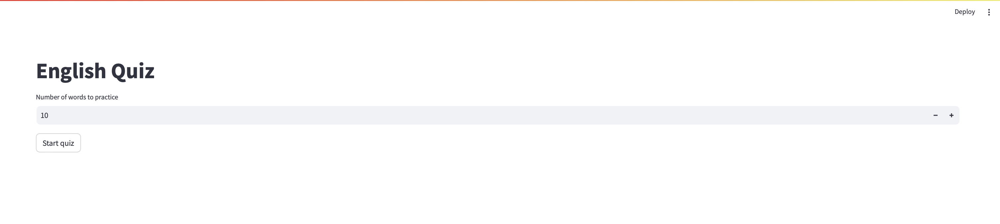
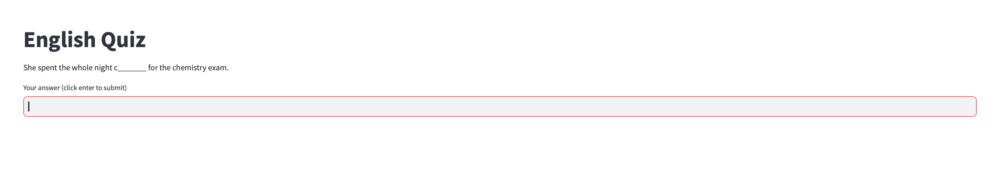

# English Quiz App
Auto-generated (with openai LLM) quiz questions for english words with quiz app in streamlit.

## Prerequisites
To run the code you need to install required packaged:
```bash
pip install -r requirements.txt
```

To run question generation you need OpenAI API key ([see here](https://help.openai.com/en/articles/4936850-where-do-i-find-my-api-key))

## Generating questions
The code generates three questions for each provided phrase, with a blank space in place of the phrase.

Phrases should be provided in a `.txt` file, where each phrase is at a separate line.

1. Create `.env` file with your OpenAI API key inside:
    ```
    OPENAI_API_KEY=<sk-YOUR_API_KEY>
    ```
2. Run `generate_questions.py`:
    ```bash
    python generate_questions.py --input <path_to_txt_file_with_phrases> -- output <path_to_save_json_with_questions>
    ```

Questions are saved in a `.json` file with a format:
```json
{
    "<phrase>": [
        [
            "<sentence_with_blank_1>",
            "<blank_content_1>"
        ],
        [
            "<sentence_with_blank_2>",
            "<blank_content_2>"
        ],
        [
            "<sentence_with_blank_3>",
            "<blank_content_3>"
        ],
    ]
}
```

## Quiz app

You can access the deployed app [here](https://mmedzin-english-quiz-app-quiz-8u3otg.streamlit.app).

>
>Main screen

>
>Question

App expects questions to be saved in a file `questions.json`.
To run the quiz app do:
```bash
streamlit run quiz.py
```
